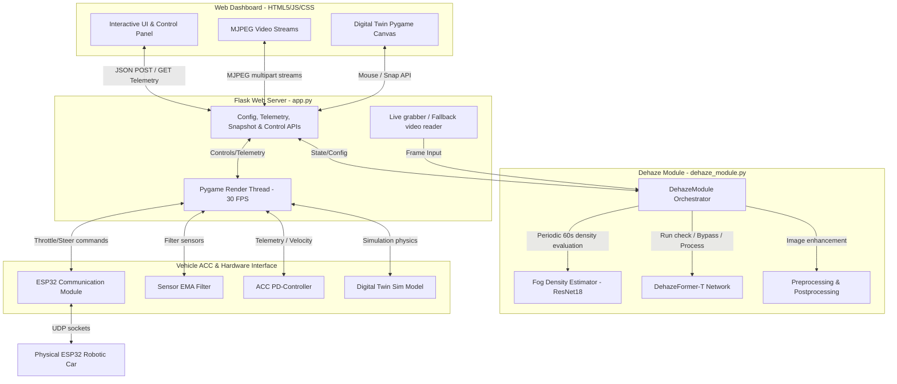

# Project Summary: Fog Vision Hazard Prevention & Digital Twin System

This project is an advanced, real-time **Fog Vision Hazard Prevention** dashboard integrated with a **Digital Twin and Adaptive Cruise Control (ACC)** simulation. It utilizes deep learning (`DehazeFormer` and a custom ResNet-18 `FogEstimator`) to adaptively clear camera feeds under heavy fog, while communicating with a real or simulated robotic car to enforce safety distances.

---

## 1. System Architecture

The following diagram illustrates how the frontend dashboard, Flask web server, Pygame simulator, hardware modules, and deep learning components interact:



---

## 2. Key Modules & Files

### A. Web Dashboard & APIs
* **[app.py](file:///c:/Users/Pratham%20Baddur/Downloads/outdoor-20260507T081233Z-3-001/outdoor/DehazeFormer/app.py)**: The main application driver. It runs Flask, registers API endpoints, manages pre-recorded video dehazing tasks, runs the headless Pygame render thread (`twin_processing_loop`), and exposes endpoints for MJPEG stream generation.
* **[templates/index.html](file:///c:/Users/Pratham%20Baddur/Downloads/outdoor-20260507T081233Z-3-001/outdoor/DehazeFormer/templates/index.html)**: A premium glassmorphic dashboard interface containing three tabs:
  1. **IMAGE / VIDEO MODE**: Upload and dehaze static files with live progress estimation.
  2. **IP CAMERA FEED**: Connect to a live RTSP/HTTP feed for real-time dehazing.
  3. **DIGITAL TWIN / ACC**: Control and monitor the robotic car with live telemetry graphs, interactive canvas overlays, and adaptive dehazing status panels.

### B. Adaptive Dehazing Core
* **[dehaze_module.py](file:///c:/Users/Pratham%20Baddur/Downloads/outdoor-20260507T081233Z-3-001/outdoor/DehazeFormer/dehaze_module.py)**: The core video grabbing and dehazing scheduler. Contains `DehazeModule` which automatically chooses between CPU/GPU execution, resizes incoming frames, and schedules the dehazing logic.
* **[fog_estimator_architecture.py](file:///c:/Users/Pratham%20Baddur/Downloads/outdoor-20260507T081233Z-3-001/outdoor/DehazeFormer/fog_estimator_architecture.py)**: Defines `FogEstimator`, a ResNet-18 regression backbone that maps a normalized `(224, 224)` image to a single scalar fog density score in the range `[0, 1]`.
* **[save_models/outdoor/dehazeformer-t.pth](file:///c:/Users/Pratham%20Baddur/Downloads/outdoor-20260507T081233Z-3-001/outdoor/DehazeFormer/save_models/outdoor)**: Pre-trained weights for the fast DehazeFormer-T model.
* **[fog_estimator.pth](file:///c:/Users/Pratham%20Baddur/Downloads/outdoor-20260507T081233Z-3-001/outdoor/DehazeFormer/fog_estimator.pth)**: Trained weights for the ResNet-18 fog density estimator.

### C. Digital Twin & Robotics Control
* **[esp32_module.py](file:///c:/Users/Pratham%20Baddur/Downloads/outdoor-20260507T081233Z-3-001/outdoor/DehazeFormer/esp32_module.py)**: Implements UDP networking with the robotic car hardware. If no hardware is connected, it automatically switches to simulation values generated by the Digital Twin model.
* **[sensor_module.py](file:///c:/Users/Pratham%20Baddur/Downloads/outdoor-20260507T081233Z-3-001/outdoor/DehazeFormer/sensor_module.py)**: Filters sensor data (Left, Center, Right distance sensors) using an Exponential Moving Average (EMA) to discard noise, and calculates relative velocity.
* **[acc_module.py](file:///c:/Users/Pratham%20Baddur/Downloads/outdoor-20260507T081233Z-3-001/outdoor/DehazeFormer/acc_module.py)**: A PD-controller (Proportional-Derivative) that computes cruise throttle. When center distance is critical, it overrides throttle and steers brakes to prevent collisions.
* **[digital_twin.py](file:///c:/Users/Pratham%20Baddur/Downloads/outdoor-20260507T081233Z-3-001/outdoor/DehazeFormer/digital_twin.py)**: The Pygame canvas renderer which maps telemetry values into a 2D physics visualization.

---

## 3. Intelligent Adaptive Dehazing Algorithm

To conserve energy, compute power, and latency, the system implements an **Adaptive Dehazing** routine:

1. **Periodic Sampling**: Every **60 seconds**, the scheduler grabs a frame and forwards it to the `FogEstimator`.
2. **Preprocessing for ResNet-18**: The frame is resized to `224x224` and normalized using ImageNet mean/standard deviation.
3. **Thresholding**:
   * If `fog_density > threshold` (default: `0.20`), **DehazeFormer** is activated.
   * If `fog_density <= threshold`, DehazeFormer is **bypassed**, displaying the unprocessed raw camera feed.
4. **Overrides**: The user can toggle **Adaptive Dehazing (Auto)** off, or enable **Force Dehazer ON** to override the estimator's decisions.

---

## 4. Image Conditioning Pipeline

The project supports customized image enhancement options defined in [image_conditioning.py](file:///c:/Users/Pratham%20Baddur/Downloads/outdoor-20260507T081233Z-3-001/outdoor/DehazeFormer/image_conditioning.py):

| Pipeline Stage | Operation / Method | Details |
| :--- | :--- | :--- |
| **Preprocessing** | **Gray-World White Balance** | Normalizes color shifts caused by haze/light scattering. |
| **Preprocessing** | **CLAHE (LAB Luminance space)** | Enhances local contrast on LAB luminance channel (clipLimit=1.4). |
| **Preprocessing** | **Gamma Correction** | Boosts details in shaded areas (gamma=0.95). |
| **Postprocessing** | **Percentile Luminance Stretch** | Restores contrast dynamic range between 1.0% and 99.2%. |
| **Postprocessing** | **Saturation Boost (1.12x)** | Restores colors faded due to mist/fog. |
| **Postprocessing** | **Unsharp Masking (Sharpen)** | Sharpens object edges and road lines (amount=0.18, sigma=1.0). |

---

## 5. Latency Optimizations

### CPU vs GPU Bottleneck
* Running the neural networks inside the virtual environment (`.venv`) restricts execution to the **CPU** (averaging **500–700 ms latency**).
* Moving execution to the global python shell unlocks **NVIDIA GeForce RTX 3050 Laptop GPU (CUDA)** execution, dropping latency to **110–130 ms per frame** (a **5x speedup**).
* In bypassed state, latency is **0.0 ms** since raw frames are sent directly to the stream.

---

## 6. How to Run the Project

1. **Close any hanging Flask / Python tasks**:
   Ensure ports `5000` (web) and `5006` (communication) are free.

2. **Launch globally with CUDA support**:
   Open a terminal and run from the repository root:
   ```bash
   python app.py
   ```

3. **Access the Dashboard**:
   Open a browser and navigate to:
   [http://127.0.0.1:5000](http://127.0.0.1:5000)
